# Lab 5 — Reverse Engineering Android : OWASP UnCrackable Level 2

> **Cours :** Sécurité des Applications Mobiles  
> **Application cible :** OWASP MASTG — UnCrackable Level 2  
> **Thème :** Analyse statique et analyse native avec JNI  
> **Plateforme :** Android (émulateur) — Windows  
> **Réalisé par :** Bouanani Nossair
> 
> **Sous la direction de :** Mohammed Lachgar  
> **Date :** 26 avril 2026

---

## Table des matières

1. [Introduction](#-introduction)
2. [Objectifs du laboratoire](#-objectifs-du-laboratoire)
3. [Environnement de travail](#-environnement-de-travail)
4. [Outils utilisés](#-outils-utilisés)
5. [Étape 1 — Installation de l'application](#étape-1--installation-de-lapplication)
6. [Étape 2 — Analyse statique avec JADX](#étape-2--analyse-statique-avec-jadx)
7. [Étape 3 — Analyse du code Java](#étape-3--analyse-du-code-java)
8. [Étape 4 — Extraction de la bibliothèque native](#étape-4--extraction-de-la-bibliothèque-native)
9. [Étape 5 — Analyse native avec Ghidra](#étape-5--analyse-native-avec-ghidra)
10. [Étape 6 — Décodage du secret avec Python](#étape-6--décodage-du-secret-avec-python)
11. [Étape 7 — Validation dynamique](#étape-7--validation-dynamique)
12. [Récapitulatif de l'analyse](#-récapitulatif-de-lanalyse)
13. [Difficultés rencontrées](#-difficultés-rencontrées)
14. [Troubleshooting](#-troubleshooting)
15. [Conclusion](#-conclusion)

---

## Introduction

Ce rapport présente l'analyse complète de l'application **UnCrackable Level 2**, publiée par l'OWASP dans le cadre du projet MASTG (Mobile Application Security Testing Guide). Ce projet propose des applications Android intentionnellement vulnérables, conçues pour permettre aux étudiants et aux professionnels de la sécurité de s'exercer aux techniques de reverse engineering.

UnCrackable Level 2 est la deuxième application de la série. Contrairement au premier niveau, qui cachait son secret uniquement dans du code Java, ce niveau **déplace la logique de vérification dans une bibliothèque native appelée `libfoo.so`**, chargée via l'interface JNI (Java Native Interface). Cette approche est courante dans les applications Android qui cherchent à rendre l'analyse plus difficile, car le code natif compilé en langage machine est nettement plus difficile à lire qu'un bytecode Java.

L'objectif principal est de retrouver le secret caché en analysant à la fois le code Java de l'application et le code natif de la bibliothèque. Ce laboratoire permet de comprendre comment fonctionne JNI, comment extraire une bibliothèque native d'un APK, et comment analyser du code compilé avec Ghidra.

---

## Objectifs du laboratoire

1. Comprendre le fonctionnement de l'interface **JNI (Java Native Interface)** dans une application Android.
2. Analyser le code Java décompilé d'une application avec **JADX**.
3. Extraire la bibliothèque native `libfoo.so` contenue dans l'APK.
4. Analyser le code natif compilé avec **Ghidra** afin de retrouver la logique de vérification.
5. Décoder les valeurs hexadécimales pour reconstituer le secret attendu.
6. Comprendre et documenter les **protections anti-debug** intégrées dans l'application.
7. Valider dynamiquement le secret trouvé sur l'émulateur Android.

---

## Environnement de travail

### Système hôte

| Élément | Détail |
|---|---|
| Système d'exploitation | Windows 10 / 11 |
| Émulateur Android | Android Studio AVD (Pixel 2, API 29) |
| Interface ADB | Android Debug Bridge (adb.exe) |
| Application cible | UnCrackable-Level2.apk (OWASP MASTG) |

### Application cible

| Propriété | Valeur |
|---|---|
| Nom du package | `owasp.mstg.uncrackable2` |
| Activité principale | `sg.vantagepoint.uncrackable2.MainActivity` |
| Bibliothèque native | `libfoo.so` |
| Fonction JNI cible | `Java_sg_vantagepoint_uncrackable2_CodeCheck_bar` |

---

## Outils utilisés

| Outil | Type | Utilisation dans ce lab |
|---|---|---|
| Android Studio | IDE / Émulateur | Exécution de l'application sur émulateur |
| ADB | Outil en ligne de commande | Installation de l'APK, capture de logs |
| JADX | Décompilateur Java | Décompilation du code Java de l'APK |
| 7-Zip | Archiveur | Extraction des fichiers internes de l'APK |
| Ghidra | Désassembleur / Décompilateur | Analyse du binaire `libfoo.so` |
| Python 3 | Langage de script | Décodage des valeurs hexadécimales |
| PowerShell | Terminal Windows | Exécution des commandes ADB et logcat |

---

## Étape 1 — Installation de l'application

### 1.1 Vérification de la connexion ADB

Avant d'installer l'application, il est nécessaire de s'assurer que l'émulateur est bien détecté par ADB :

```powershell
.\adb.exe devices
```

L'émulateur est bien détecté sous l'identifiant `emulator-5554`. Le statut `device` confirme que la connexion ADB est active.

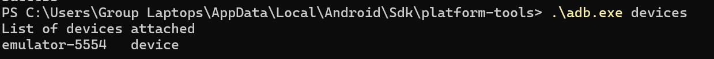

### 1.2 Installation de l'APK

Une fois la connexion confirmée, l'application est installée :

```powershell
.\adb.exe install "UnCrackable-Level2.apk"
```

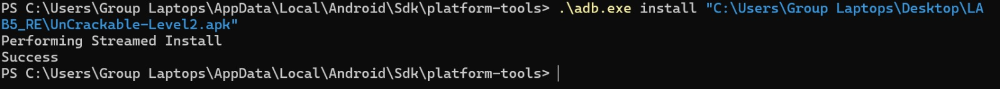

Ce résultat confirme que l'APK a été correctement transféré et installé sur l'émulateur. L'application est maintenant accessible depuis le lanceur d'applications Android.

---

## Étape 2 — Analyse statique avec JADX

### 2.1 Ouverture de l'APK dans JADX

JADX est un outil de décompilation qui permet de transformer le bytecode Dalvik (format `.dex`) contenu dans un APK en code Java lisible.

```
jadx-gui UnCrackable-Level2.apk
```

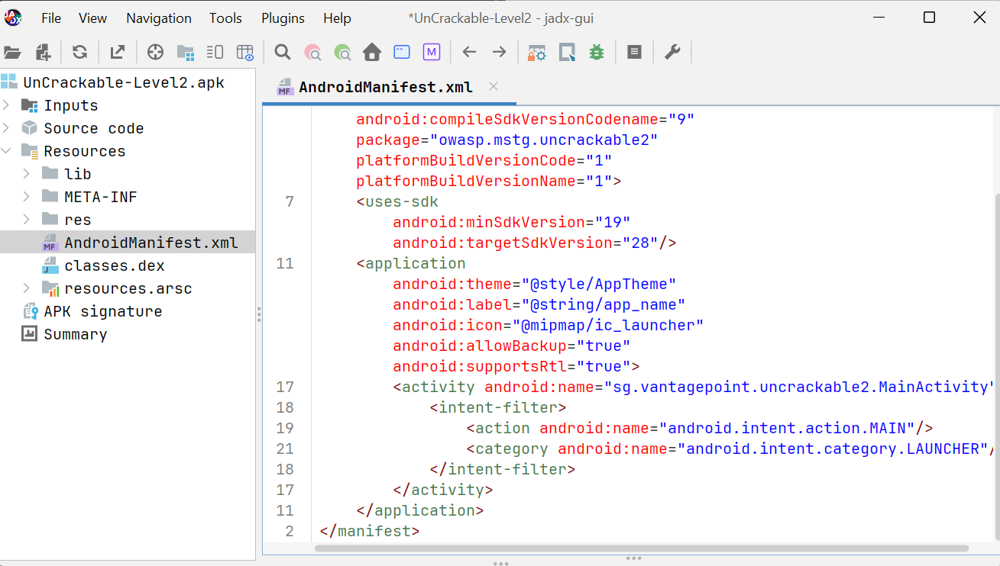

### 2.2 Analyse du fichier AndroidManifest.xml

Le fichier `AndroidManifest.xml` est le point de départ de toute analyse d'application Android. Il contient des informations essentielles sur la structure, les permissions et les composants de l'application.


La capture présente le contenu du fichier `AndroidManifest.xml`. On y lit que :
- Le **package** de l'application est `owasp.mstg.uncrackable2`
- L'**activité principale** est `sg.vantagepoint.uncrackable2.MainActivity`

---

## Étape 3 — Analyse du code Java

### 3.1 Classe MainActivity

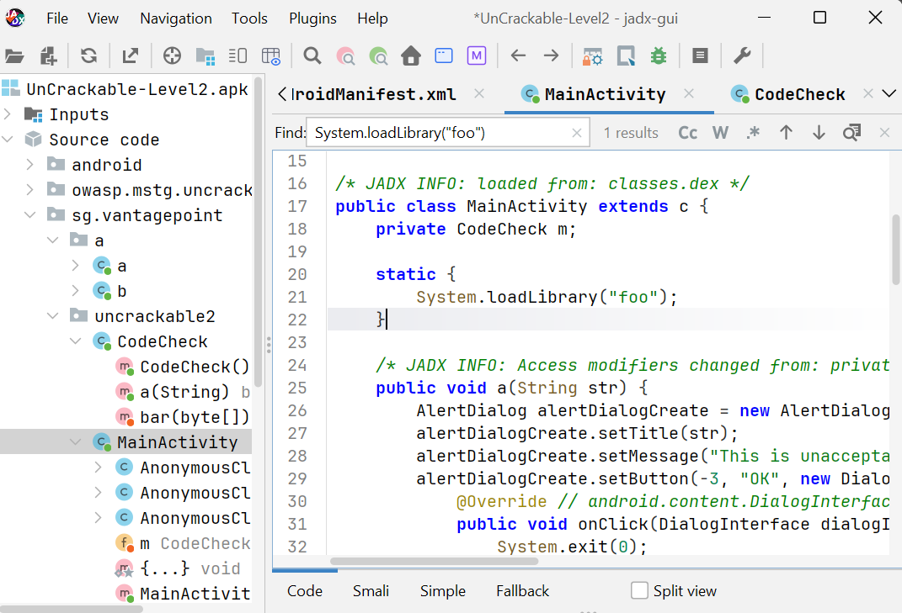

Voici le code complet de la classe `MainActivity` tel qu'il a été récupéré avec JADX :

```java
package sg.vantagepoint.uncrackable2;

import android.app.AlertDialog;
import android.os.AsyncTask;
import android.os.Bundle;
import android.os.Debug;
import android.os.SystemClock;
import android.view.View;
import android.widget.EditText;

public class MainActivity extends c {
    private CodeCheck m;

    static {
        System.loadLibrary("foo"); // Charge libfoo.so
    }

    private native void init();

    @Override
    protected void onCreate(Bundle bundle) {
        init();
        if (b.a() || b.b() || b.c()) {
            a("Root detected!");
        }
        if (a.a(getApplicationContext())) {
            a("App is debuggable!");
        }
        new AsyncTask<Void, String, String>() {
            public String doInBackground(Void... voidArr) {
                while (!Debug.isDebuggerConnected()) {
                    SystemClock.sleep(100L);
                }
                return null;
            }
            public void onPostExecute(String str) {
                MainActivity.this.a("Debugger detected!");
            }
        }.execute(null, null, null);

        this.m = new CodeCheck();
        super.onCreate(bundle);
        setContentView(R.layout.activity_main);
    }

    public void verify(View view) {
        String string = ((EditText) findViewById(R.id.edit_text))
            .getText().toString();
        AlertDialog alertDialogCreate =
            new AlertDialog.Builder(this).create();
        if (this.m.a(string)) {
            alertDialogCreate.setTitle("Success!");
            alertDialogCreate.setMessage("This is the correct secret.");
        } else {
            alertDialogCreate.setTitle("Nope...");
            alertDialogCreate.setMessage("That's not it. Try again.");
        }
        alertDialogCreate.show();
    }
}
```

#### Explication détaillée du code

**A. Chargement de la bibliothèque native**

```java
static {
    System.loadLibrary("foo");
}
```

Ce bloc statique est exécuté dès que la classe est chargée en mémoire, avant même qu'une instance soit créée. La méthode `System.loadLibrary("foo")` charge la bibliothèque partagée `libfoo.so` depuis le dossier `lib/` de l'APK. C'est cette bibliothèque qui contient la logique de vérification du secret.

**B. Protections Anti-Debug et Anti-Root**

L'application implémente trois mécanismes de protection distincts :

1. **Détection de root** — `b.a()`, `b.b()`, `b.c()` vérifient si l'appareil est rooté en cherchant la présence de binaires comme `su`, en vérifiant les propriétés système, ou en testant des fichiers caractéristiques d'un root.

2. **Mode débogage** — `a.a(getApplicationContext())` vérifie si l'application a été compilée avec le flag `android:debuggable="true"`.

3. **Détection du débogueur en temps réel** — Un `AsyncTask` tourne en arrière-plan en boucle. Il vérifie toutes les 100 ms si un débogueur est connecté via `Debug.isDebuggerConnected()`.

**C. Point d'entrée de la validation**

Lorsque l'utilisateur clique sur "VERIFY", la méthode `verify()` récupère le texte saisi et l'envoie à `this.m.a(string)`, une instance de la classe `CodeCheck`.

### 3.2 Classe CodeCheck

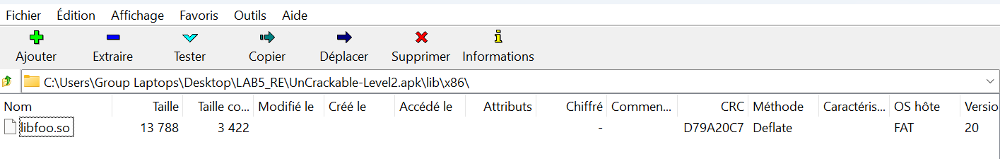

```java
package sg.vantagepoint.uncrackable2;

public class CodeCheck {
    private native boolean bar(byte[] bArr);

    public boolean a(String str) {
        return bar(str.getBytes());
    }
}
```

La méthode `a(String str)` reçoit la chaîne saisie par l'utilisateur, la convertit en tableau d'octets avec `str.getBytes()`, puis la transmet à la méthode native `bar()`.

> **Le mot-clé `native`** indique que l'implémentation se trouve dans `libfoo.so` et **non** dans le code Java. Cette architecture est courante dans les applications cherchant à compliquer la rétro-ingénierie.

---

## Étape 4 — Extraction de la bibliothèque native

Un fichier APK est en réalité une **archive ZIP**. En l'ouvrant avec 7-Zip, on peut naviguer dans son contenu et extraire les fichiers souhaités. Le dossier `lib/` contient les bibliothèques natives organisées par architecture (`x86`, `arm`, `arm64`, etc.).

**Sous Windows** : renommer l'extension `.apk` en `.zip` ou utiliser 7-Zip directement pour ouvrir l'archive.

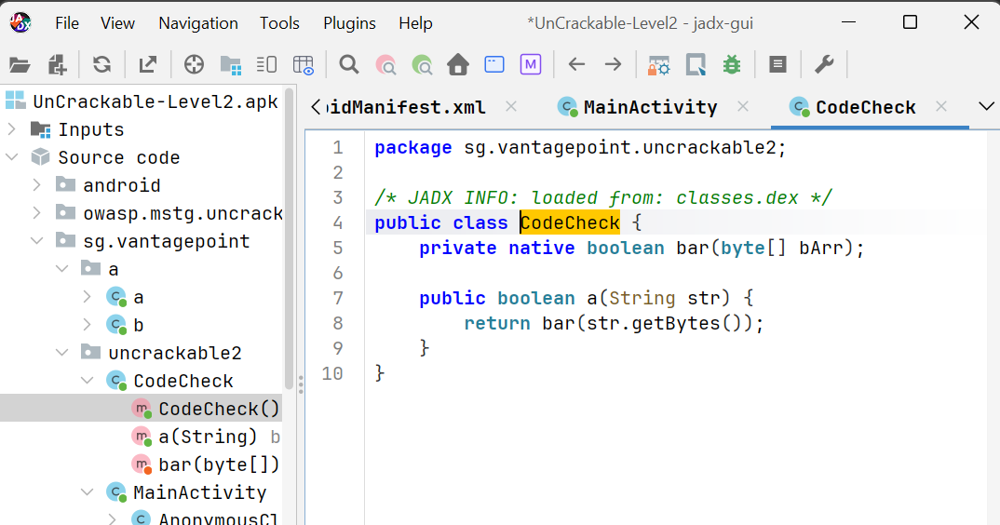

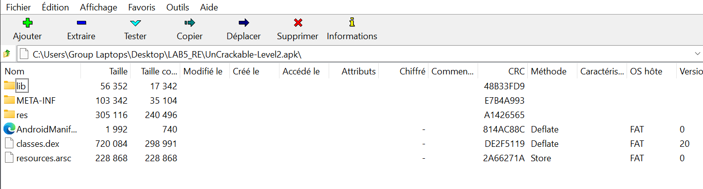

La convention Android est la suivante : `System.loadLibrary("foo")` charge le fichier `libfoo.so`. Le préfixe `lib` et l'extension `.so` sont ajoutés automatiquement par le système.

---

## Étape 5 — Analyse native avec Ghidra

### 5.1 Import de libfoo.so dans Ghidra

Ghidra est un outil d'analyse de code binaire développé par la NSA et publié en open source. Il permet de désassembler et décompiler des fichiers binaires sans accès au code source.

```
C:\ghidra_12.0.4_PUBLIC> ghidraRun.bat
```

Créer un nouveau projet → File → Import File → sélectionner `libfoo.so` → lancer l'analyse automatique.

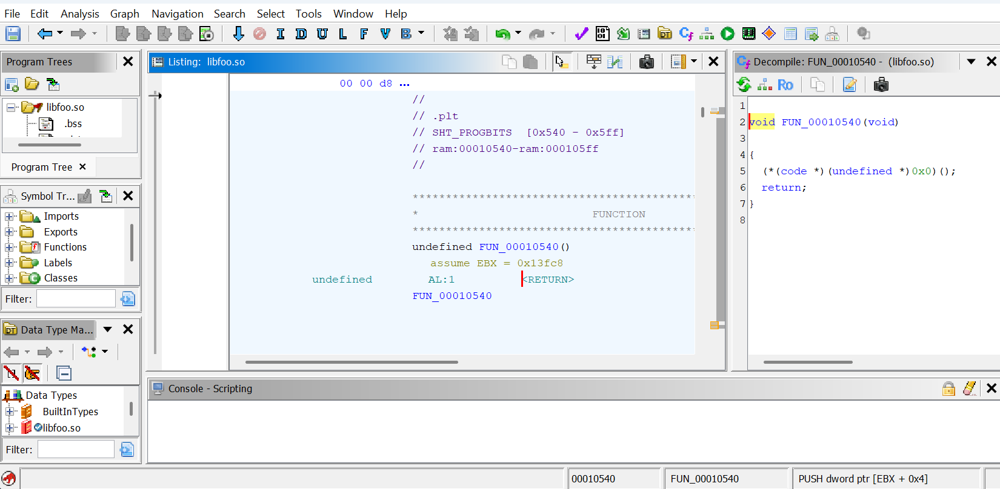

### 5.2 Localisation de la fonction JNI

La convention de nommage JNI est stricte : `Java_<package>_<classe>_<methode>`, où les points du package sont remplacés par des underscores.

Pour la méthode `bar()` dans `sg.vantagepoint.uncrackable2.CodeCheck`, le nom JNI devient :

```
Java_sg_vantagepoint_uncrackable2_CodeCheck_bar
```

Dans la fenêtre **Symbol Tree** (à gauche), filtrer avec `Java_` pour localiser la fonction.

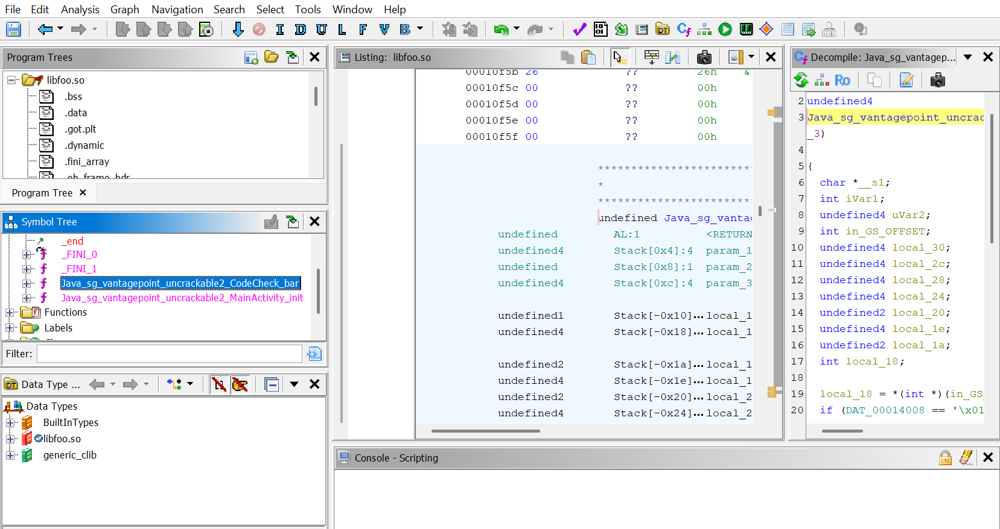

### 5.3 Analyse du pseudo-code Ghidra

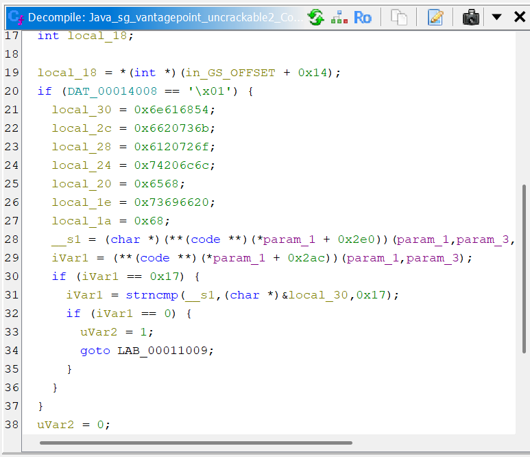

```c
undefined4
Java_sg_vantagepoint_uncrackable2_CodeCheck_bar(
    int *param_1, undefined4 param_2, undefined4 param_3)
{
    char *__s1;
    int iVar1;
    undefined4 uVar2;
    int in_GS_OFFSET;
    undefined4 local_30;
    undefined4 local_2c;
    undefined4 local_28;
    undefined4 local_24;
    undefined2 local_20;
    undefined4 local_1e;
    undefined2 local_1a;
    int local_18;

    local_18 = *(int *)(in_GS_OFFSET + 0x14);
    if (DAT_00014008 == '\x01') {
        local_30 = 0x6e616854; // octets : 54 68 61 6e -> "Than"
        local_2c = 0x6620736b; // octets : 6b 73 20 66 -> "ks f"
        local_28 = 0x6120726f; // octets : 6f 72 20 61 -> "or a"
        local_24 = 0x74206c6c; // octets : 6c 6c 20 74 -> "ll t"
        local_20 = 0x6568;     // octets : 68 65       -> "he"
        local_1e = 0x73696620; // octets : 20 66 69 73 -> " fis"
        local_1a = 0x68;       // octet  : 68          -> "h"

        __s1 = (char *)(**(code **)(*param_1 + 0x2e0))(param_1, param_3, 0);
        iVar1 = (**(code **)(*param_1 + 0x2ac))(param_1, param_3);

        if (iVar1 == 0x17) {
            iVar1 = strncmp(__s1, (char *)&local_30, 0x17);
            if (iVar1 == 0) {
                uVar2 = 1;
                goto LAB_00011009;
            }
        }
    }
    uVar2 = 0;
LAB_00011009:
    if (*(int *)(in_GS_OFFSET + 0x14) == local_18) {
        return uVar2;
    }
    __stack_chk_fail();
}
```

#### Explication de la logique

**1. Variables locales = le secret**

Les sept variables (`local_30` à `local_1a`) stockent le secret sous forme de constantes hexadécimales. En mode **little-endian** sur x86, l'ordre des octets est inversé dans chaque entier :

| Variable | Valeur hex | Octets (little-endian) | ASCII |
|---|---|---|---|
| `local_30` | `0x6e616854` | `54 68 61 6e` | `Than` |
| `local_2c` | `0x6620736b` | `6b 73 20 66` | `ks f` |
| `local_28` | `0x6120726f` | `6f 72 20 61` | `or a` |
| `local_24` | `0x74206c6c` | `6c 6c 20 74` | `ll t` |
| `local_20` | `0x6568`     | `68 65`       | `he`  |
| `local_1e` | `0x73696620` | `20 66 69 73` | ` fis` |
| `local_1a` | `0x68`       | `68`          | `h`   |

**2. Récupération de l'entrée utilisateur**

L'appel JNI `(*param_1 + 0x2e0)` correspond à la fonction `GetStringUTFChars` de l'environnement JNI. Elle convertit l'objet Java passé en paramètre en une chaîne C classique, stockée dans `__s1`.

**3. Vérification de la longueur (`0x17 = 23`)**

```c
if (iVar1 == 0x17) { ... }
```

La valeur `0x17` en hexadécimal vaut **23** en décimal. Si l'entrée ne fait pas exactement 23 caractères, la vérification échoue immédiatement.

**4. Comparaison avec `strncmp`**

```c
iVar1 = strncmp(__s1, (char *)&local_30, 0x17);
if (iVar1 == 0) { uVar2 = 1; }
```

`strncmp` compare les 23 premiers caractères de l'entrée avec la chaîne stockée dans les variables locales. Si les deux chaînes sont identiques, la fonction retourne `0` et la validation réussit.

> ⚠️ **Note little-endian :** Sur architecture x86, les entiers multi-octets sont stockés en mémoire avec l'octet de poids faible en premier. La valeur `0x6e616854` est donc stockée dans l'ordre `54 68 61 6e`, ce qui correspond aux caractères `T h a n`.

---

## Étape 6 — Décodage du secret avec Python

En assemblant les valeurs hexadécimales dans le bon ordre (little-endian), on obtient la séquence complète :

```
5468616e6b7320666f7220616c6c207468652066697368
```

**Script Python (`scripts/decoder.py`) :**

```python
# Conversion de la séquence hexadécimale (reconstituée après inversion Little-Endian)
hex_data = "5468616e6b7320666f7220616c6c207468652066697368"
secret = bytes.fromhex(hex_data).decode("ascii")
print(f"[*] Le secret décodé est : {secret}")
print(f"[*] Longueur : {len(secret)} caractères (Attendu : 23 / 0x17)")
```

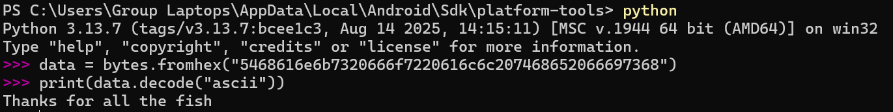

> **Secret trouvé : `Thanks for all the fish`**  
> Cette chaîne contient exactement **23 caractères** (0x17 en hexadécimal), ce qui correspond à la condition vérifiée dans le code natif.

---

## Étape 7 — Validation dynamique

### 7.1 Résultat de la validation sur l'émulateur

En entrant la chaîne `Thanks for all the fish` dans le champ de texte puis en appuyant sur le bouton **VERIFY**, une boîte de dialogue s'affiche avec le message **"Success! This is the correct secret."**

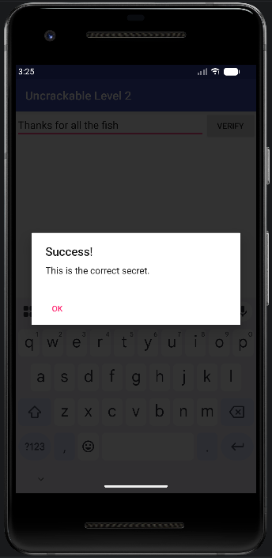

Cette étape valide concrètement la démarche d'analyse statique effectuée.

### 7.2 Problème rencontré sur certaines configurations

Sur certaines configurations d'émulateur, l'application peut se fermer abruptement au démarrage. Diagnostic via logcat :

```powershell
.\adb.exe logcat -d | findstr /i "Root Debugger debuggable fatal exception"
```

Résultat observé :

```
FATAL EXCEPTION: main
java.lang.RuntimeException: Unable to start activity
java.lang.RuntimeException: Bad file descriptor
Fatal signal 6 (SIGABRT)
```

L'erreur `SIGABRT` indique que le code natif a volontairement terminé le processus. Solutions recommandées :
- Utiliser un émulateur **Android 9 (API 28)** ou **Android 10 (API 29)**
- Vérifier que l'architecture de l'émulateur correspond à celle de `libfoo.so` (x86 ou ARM)

---

## Récapitulatif de l'analyse

### Flux complet de vérification

```
Utilisateur saisit un texte dans EditText
            ↓
    verify() dans MainActivity
            ↓
    CodeCheck.a(String str)
            ↓
    str.getBytes() → tableau d'octets
            ↓
  CodeCheck.bar(byte[] bArr) — méthode native
            ↓
         JNI → libfoo.so
            ↓
Java_sg_vantagepoint_uncrackable2_CodeCheck_bar()
            ↓
    Vérif. longueur == 23 (0x17)
            ↓
strncmp(entrée, "Thanks for all the fish", 23)
            ↓
    Retourne 1 (succès) ou 0 (échec)
```

### Tableau récapitulatif des étapes

| N° | Outil | Action réalisée | Résultat |
|---|---|---|---|
| 1 | ADB | Installation de l'APK | ✅ OK |
| 2 | JADX | Décompilation Java | ✅ OK |
| 3 | JADX | Analyse MainActivity | ✅ OK |
| 4 | JADX | Analyse CodeCheck | ✅ OK |
| 5 | 7-Zip | Extraction libfoo.so | ✅ OK |
| 6 | Ghidra | Import et analyse du binaire | ✅ OK |
| 7 | Ghidra | Localisation de CodeCheck_bar | ✅ OK |
| 8 | Python | Décodage hexadécimal | ✅ OK |
| 9 | Émulateur | Validation dynamique | ✅ Confirmé |

---

## ⚠️ Difficultés rencontrées

### Crash de l'application au démarrage

La principale difficulté rencontrée est le crash de l'application sur certaines versions d'émulateur. L'erreur `Bad file descriptor` empêche l'interface graphique de s'afficher. Ce problème illustre l'importance de l'analyse statique : même sans exécuter l'application, il est possible de retrouver le secret.

### Compréhension du format little-endian

Lors de l'analyse des variables locales dans Ghidra, les valeurs hexadécimales semblent former une chaîne incohérente si l'on ignore l'ordre little-endian. Par exemple, `0x6e616854` donne les octets `54 68 61 6e`, soit les caractères `T`, `h`, `a`, `n`. Le script Python prend en charge cette inversion automatiquement.

### Navigation dans Ghidra

Ghidra est un outil puissant mais dont la prise en main nécessite du temps. L'analyse automatique peut durer plusieurs minutes sur un binaire de taille significative.

---

## 🔧 Troubleshooting

| Problème | Diagnostic | Solution |
|---|---|---|
| L'application se ferme au démarrage | `adb logcat` → `SIGABRT` | Utiliser un émulateur API 28/29 |
| ADB ne détecte pas l'émulateur | `adb devices` retourne vide | `adb kill-server` puis `adb start-server` |
| JADX affiche du code obfusqué | Noms de variables à une lettre | Normal — se concentrer sur la logique globale |
| Ghidra génère un pseudo-code difficile | Types `undefined4`, casts complexes | Renommer les variables (clic droit → Rename Variable) |

---

## ✅ Conclusion

Ce laboratoire a démontré comment analyser une application Android qui délègue sa logique de sécurité à une bibliothèque native. En combinant plusieurs outils complémentaires — JADX pour le code Java, Ghidra pour le code natif, et Python pour le décodage — il a été possible de retrouver le secret **Thanks for all the fish** de manière entièrement statique.

L'analyse a suivi une approche méthodique et structurée :
1. Compréhension de la structure de l'application via le manifeste et le code Java.
2. Identification du point d'entrée natif grâce à la convention JNI.
3. Analyse de la logique de vérification dans le pseudo-code Ghidra.
4. Décodage des constantes hexadécimales en tenant compte du format little-endian.

Ce laboratoire illustre également les limites des protections purement techniques : même avec du code natif compilé et des mécanismes anti-debug, un analyste peut retrouver les informations sensibles par analyse statique.

| | |
|---|---|
| **Secret final** | `Thanks for all the fish` |
| **Longueur** | 23 caractères (0x17) |
| **Méthode utilisée** | Analyse statique (JADX + Ghidra + Python) |
| **Validation dynamique** | ✅ Confirmée |

---

*Analyse réalisée à des fins éducatives — OWASP MASTG*
